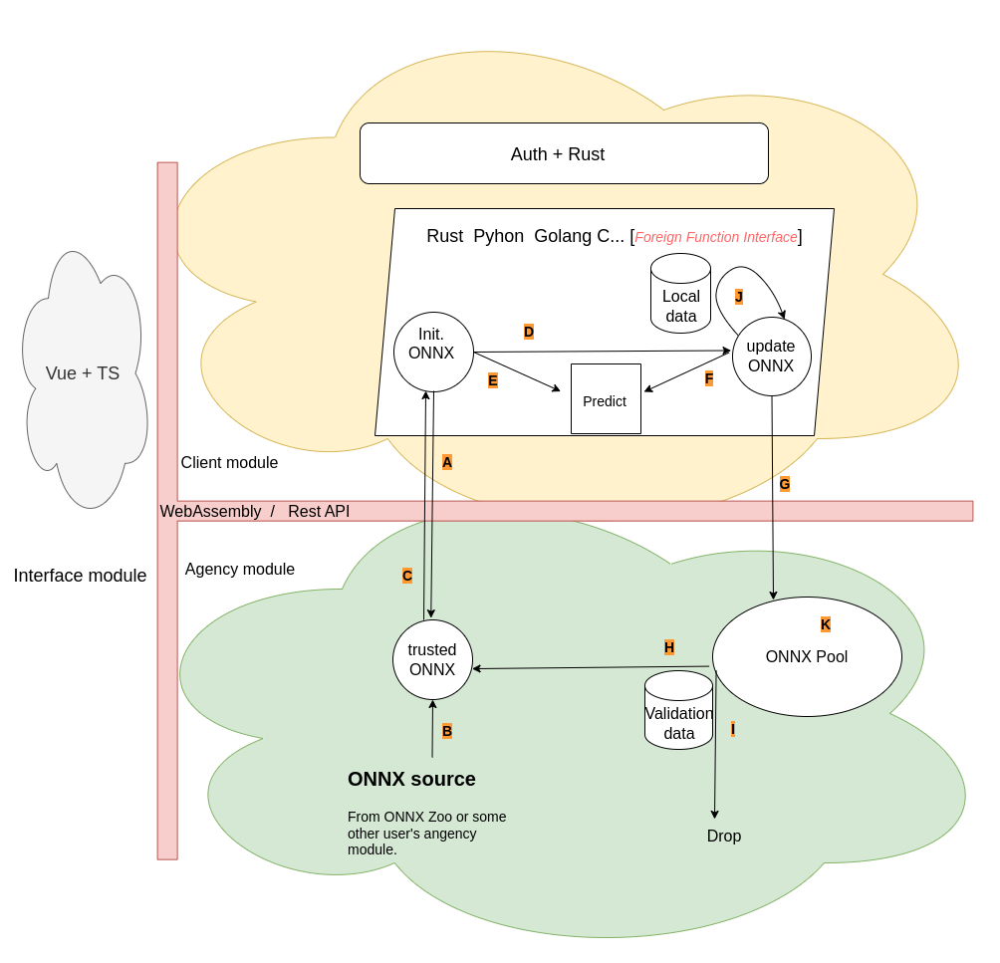

# Propose

This project is going to create a federated learning framework with Rust. Known for its safety, Rust provides a terrific playground for our propose. Our propose is to design a architecture, which can combine decenterlized learning and cross-Silo learning use cases. At the same time, privacy problem and poisoning attack will also be token into consideration. This project has been divided into three modules. The communication can be implemented with REST-form between different ports OR with WebAssembly. 

